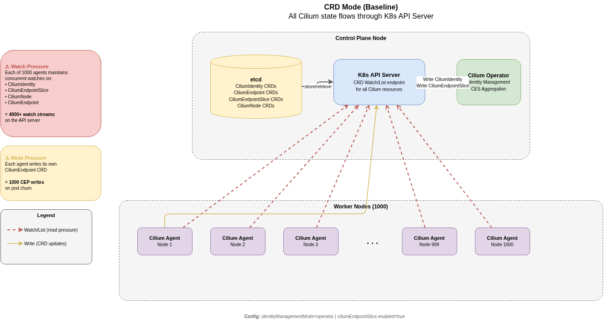
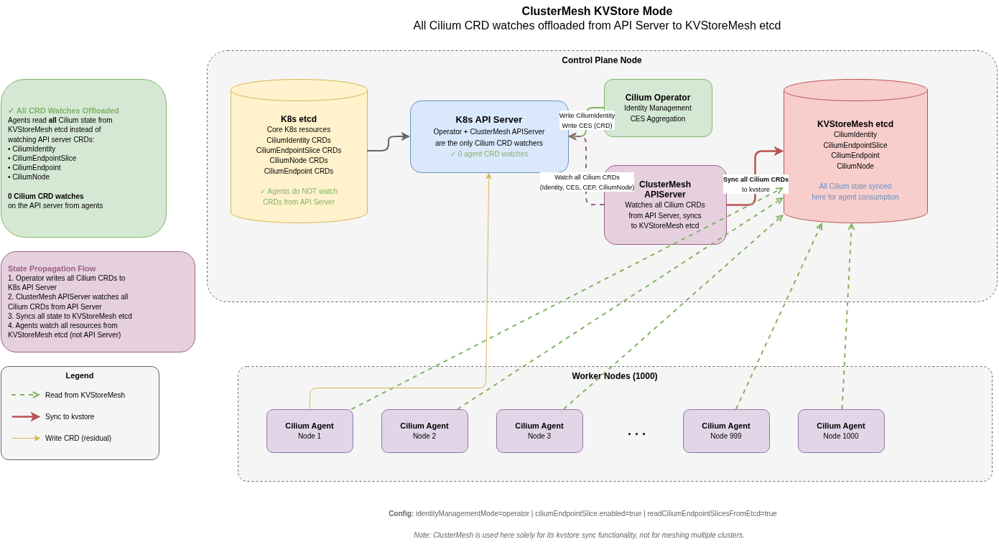
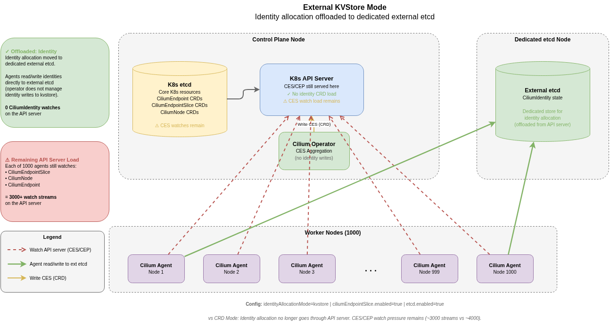
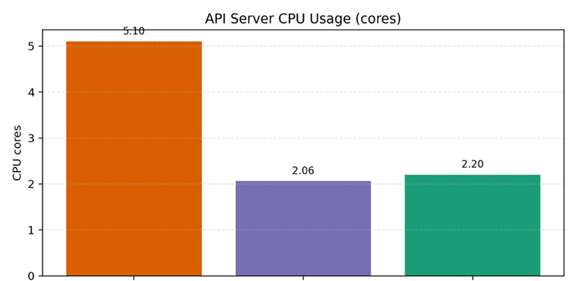
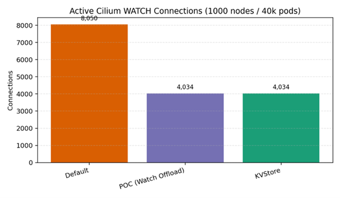
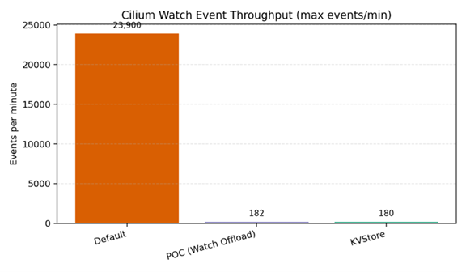

# Comparing API Server Resource Utilization Across Cilium Control Plane Modes

## 1. Motivation

In large-scale Kubernetes clusters, the current Cilium control plane model
places significant pressure on the Kubernetes API server. Each Cilium agent
maintains multiple watches on custom resources such as CiliumEndpoint,
CiliumIdentity, and CiliumNode, leading to high watch event throughput and
increased serialization overhead. This drives up API server CPU consumption and
can result in throttling or control plane instability — especially in
environments where scaling control plane resources is constrained or not
feasible.

## 2. Proposed Approach

To address the API server resource problem, we propose:

1. **Utilize ClusterMesh etcd as an alternative datastore** — avoids
   provisioning and maintaining a separate external KVStore. ClusterMesh etcd
   should also work with a **single cluster** as a database provider, without
   forcing users into multi-cluster meshing.
2. **Push toward ClusterMesh API Server / Cilium Operator as the centralized
   control plane** — consolidate state propagation into fewer components.
3. **Store data in ClusterMesh etcd directly** — eliminates the duplication
   overhead of the ClusterMesh API Server mirroring Cilium resources from the
   K8s API server into etcd.
4. **Improve cluster scalability** with limited K8s API server resources.

## 3. POC — Phase 1

This POC focuses on quick tweaks to the **cilium-agent** and **ClusterMesh API
Server** to utilize the ClusterMesh etcd as the Cilium datastore and compare
the resulting improvements in K8s API server resource utilization.

---

## 4. Modes Under Test

### 4.1 CRD Mode (Baseline)

The standard Cilium configuration. All Cilium state — identities, endpoints,
endpoint slices, and node objects — is maintained as Kubernetes Custom
Resources and managed via the K8s API server.

**Key characteristics:**
- Every agent opens watch streams for CiliumIdentity, CiliumEndpointSlice,
  CiliumNode, and other CRDs
- At 1,000 nodes this creates **≥ 4,000 concurrent watch streams** on the API
  server (4+ CRD types × 1,000 agents + operator watches)
- API server bears the full serialization and fan-out cost

**Configuration:**
- Operator-managed identity enabled
- CiliumEndpointSlice with Slim enabled (creation of CES from K8s Pods)

<!-- Architecture diagram: CRD Mode — see crd-mode-architecture.drawio page 1 -->

---

### 4.2 ClusterMesh KVStore Mode

ClusterMesh KVStore Mode uses the ClusterMesh etcd as an **alternative data
distribution layer** instead of having all agents depend directly on the
Kubernetes API server. For this POC, ClusterMesh is leveraged primarily for
rapid experimentation and reuse of the existing ClusterMesh API Server code as
a centralized control plane component responsible for watching and propagating
control plane state.

In this model, the Cilium Operator and Cilium Agents continue to create and
update all Cilium CRDs (Identities, CES, CiliumNode, etc.) in the Kubernetes
API server as part of their normal operation. The ClusterMesh API Server
watches these CRDs from the API server and synchronizes them into a KVStoreMesh
etcd instance. Cilium Agents then consume **all** control plane state directly
from the KVStoreMesh etcd instead of maintaining CRD watches against the
Kubernetes API server. This effectively removes large-scale agent watch
amplification from the API server and significantly reduces API server CPU
usage and watch event throughput.

**Key characteristics:**
- Operator manages identities and writes all CRDs to the K8s API server
- ClusterMesh API Server watches all Cilium CRDs and syncs to KVStoreMesh etcd
- Agents read all resources (Identity, CES, CEP, CiliumNode) from KVStoreMesh
  etcd
- Operationally simpler than External KVStore — no separate etcd to manage

**Configuration:**
- `read-ces-from-clustermesh` (custom flag — enables agents to read Cilium
  resources from ClusterMesh etcd)
- Operator-managed identity enabled
- CiliumEndpointSlice with Slim enabled (creation of CES from K8s Pods)

<!-- Architecture diagram: ClusterMesh KVStore Mode — see crd-mode-architecture.drawio page 2 -->

---

### 4.3 External KVStore Mode

Identity allocation is moved to a **dedicated etcd instance** running
independently of the K8s API server. Each agent directly reads and writes
identities to the external etcd — the operator does **not** handle identity
writes to the kvstore. Other CRDs such as CiliumEndpointSlice and CiliumNode
continue to be processed through the API server.

**Key characteristics:**
- Removes CiliumIdentity watches from the API server entirely
- Agents open direct gRPC connections to external etcd for identity read/write
- API server watch streams reduced to **~3,000** (CES + CiliumNode + others)
- Requires provisioning and managing a separate etcd cluster

<!-- Architecture diagram: External KVStore Mode — see crd-mode-architecture.drawio page 3 -->

---

## 5. Metrics Measured

| Metric | Prometheus Counter |
|---|---|
| **API Server CPU** | `process_cpu_seconds_total` |
| **Watch Event Throughput** | `apiserver_watch_events_per_min` |
| **API Server Memory (RSS)** | `process_resident_memory_bytes` |

---

## 6. Test Setup

| Parameter | Value |
|---|---|
| **K8s API Server** | 8 vCPU / 32 GB |
| **Nodes** | 1,000 worker nodes per cluster (4 vCPU / 16 GB) |
| **Control Plane** | 1 control-plane node (8 vCPU / 32 GB) |
| **Kubernetes** | v1.31 (kubeadm) |
| **Cilium Chart** | v1.19.0-dev |
| **Load Generator** | ClusterLoader2 |
| **Namespaces** | 1,000 |
| **Pods** | 40,000 |
| **Deployments** | 4,000 |
| **Pod Deployment Rate** | 100 pods/sec |

**Workload churn methodology:** Pods are deployed, then deleted. The system
waits 15 minutes for the operator to clean up Cilium identities before
repeating the load churn. Each mode completes **3 churn cycles** under
identical conditions.

Each mode is deployed on its own independent cluster so results are not
cross-contaminated.

---

## 7. Test Results

### API Server CPU Utilization

In ClusterMesh KVStore mode, CPU utilization dropped by **more than 50%**
compared to CRD Mode.

<!-- Replace with actual Grafana graph -->

### Watch Connections

Watch connections dropped by **50%** in ClusterMesh KVStore mode compared to
CRD Mode.

<!-- Replace with actual Grafana graph -->

### Watch Event Throughput

Watch events per minute dropped by **more than 95%** in ClusterMesh KVStore
mode compared to CRD Mode.

<!-- Replace with actual Grafana graph -->

### Results Summary

| Metric | CRD Mode → ClusterMesh KVStore |
|---|---|
| **API Server CPU** | ↓ > 50 % |
| **Watch Connections** | ↓ ~ 50 % |
| **Watch Events / min** | ↓ > 95 % |

---

## 8. Next Steps

- Implement dedicated centralized control plane activities — network policy
  calculations, ipcache — into Cilium Operator / ClusterMesh API Server / a
  new component.
- Store data in ClusterMesh etcd directly to eliminate API Server → etcd
  duplication overhead.
